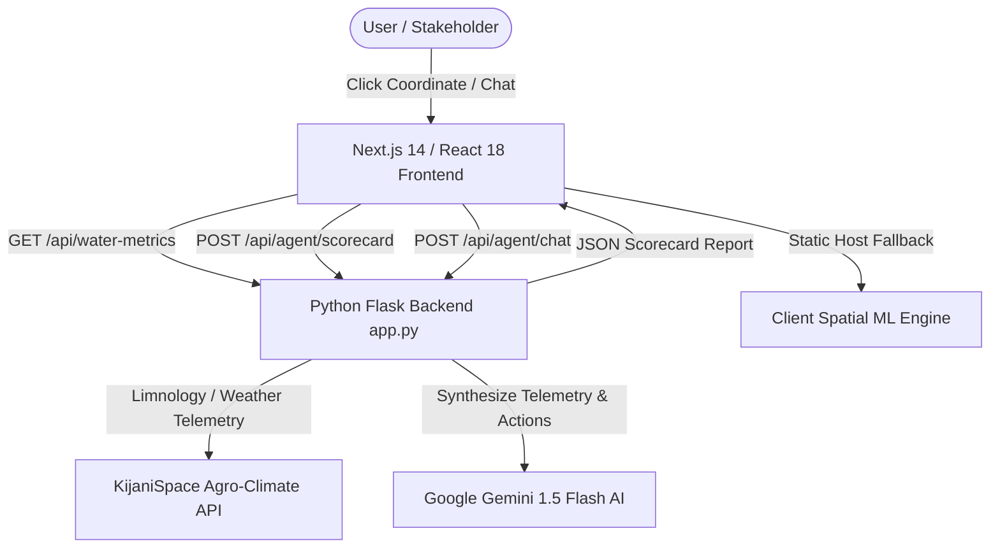

JONAM - Lake Victoria Pollution & Ecological Risk Assessment Model

An interactive, machine-learning-driven environmental monitoring and risk assessment platform built to protect **Lake Victoria's** ecosystem. **JONAM** evaluates live water telemetry, satellite climatology, and weather forecasts to predict water hyacinth weed mat expansion and safeguard native fish stocks (Tilapia & Nile Perch).

---

## 🌊 Overview & Core Mission

Lake Victoria faces severe ecological pressures caused by agricultural runoff, industrial effluent, and warming surface temperatures. **JONAM** provides decision-makers, harbor managers, and fisheries officers with predictive risk assessments focusing on two interconnected challenges:

1. **🌿 Hyacinth Proliferation Control**: Monitors satellite Chlorophyll-a concentrations ($>40\text{ mg/m}^3$) and wind vectors to forecast floating weed mat accumulation before it clogs transportation corridors, water intakes, and harbors.
2. **🐟 Fish Stock Protection (Tilapia & Nile Perch)**: Tracks underwater light extinction (Turbidity $K_{490} > 1.5\text{ m}^{-1}$) and decaying weed biomass hypoxia to safeguard littoral fish breeding bays and spawning grounds.

---

## ✨ Key Features

* 🗺️ **Interactive Spatial ML Map**: Leaflet-powered spatial interface centered over Lake Victoria. Click any aquatic coordinate (e.g. Kisumu Bay, Homa Bay, Entebbe) or inland point to run instant machine learning risk inference.
* 📊 **Dual Risk Gauges**:
  * **Hyacinth Biomass Proliferation Index (%)**: Derived from Chlorophyll-a density, surface temperature, and nutrient transport.
  * **Fish Stock Vulnerability Index (%)**: Derived from turbidity light attenuation and oxygen depletion risk.
* 🛰️ **Live Water Telemetry Inputs**:
  * **Chlorophyll-a** ($\text{mg/m}^3$)
  * **Turbidity / $K_{490}$** ($\text{m}^{-1}$)
  * **Surface Water Temperature** ($\text{°C}$)
  * **Wind Speed** ($\text{m/s}$)
  * **Precipitation** ($\text{mm}$)
* 🤖 **AI Limnological Reasoning Engine**: Powered by Google Gemini 1.5 Flash to synthesize complex multi-parameter telemetry into actionable management decisions (e.g. containment boom deployment, mechanical harvesting schedules, eco-protection nursery zones).
* 💬 **ML Decision Assistant**: Interactive chat interface enabling stakeholders to query the AI reasoning engine directly for context-aware ecological advice.
* ⚡ **Dual-Engine Resilience**: Seamlessly operates with a live Python Flask backend or falls back to a standalone client spatial inference engine on static production hosts (e.g. Firebase Hosting).

---

## 🏗️ System Architecture

### Stack Components:
* **Frontend**: Next.js 14, React 18, Tailwind CSS, Leaflet.js, Lucide Icons.
* **Backend**: Python 3.11, Flask, Flask-CORS, Requests, NumPy, Pillow.
* **External APIs**: KijaniSpace Agro-Climate API (`api.kijanispace.eu`), Google Gemini AI REST API.
* **Deployment**: Docker (`Dockerfile`), Firebase Hosting (`firebase.json`).

---

## 📡 API Endpoints

### 1. Water Telemetry
`GET /api/water-metrics?lat={lat}&lon={lon}`
* Returns Chlorophyll-a, Turbidity ($K_{490}$), water temperature, wind speed, and precipitation for the given coordinate in Lake Victoria.

### 2. Ecological Risk Scorecard
`POST /api/agent/scorecard`
* **Body**: `{ "location": "Kisumu Bay", "latitude": -0.1022, "longitude": 34.7617, "metrics": { ... } }`
* **Response**: Returns dual risk scores, status level (`LOW`, `MODERATE`, `SEVERE RISK`), telemetry snapshot, AI agent summary, and targeted action items for hyacinth control and fish stock protection.

### 3. ML Decision Assistant Chat
`POST /api/agent/chat`
* **Body**: `{ "message": "How do wind patterns affect hyacinth movement in Kisumu?", "session_id": "session-1" }`
* **Response**: Returns AI-generated limnological guidance.

---

## 🚀 Getting Started
